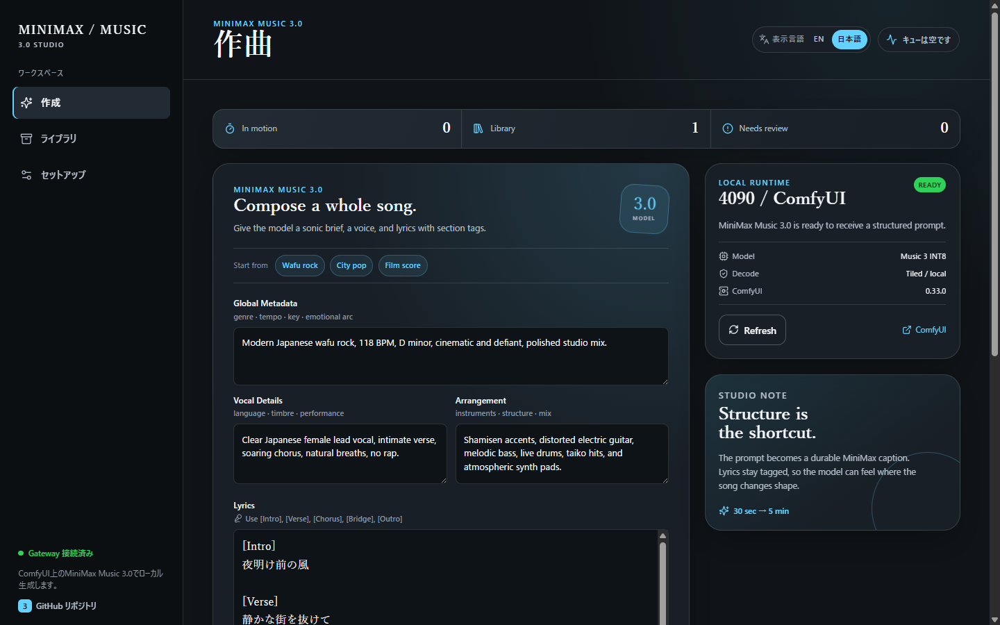

# MiniMax Music 3.0 Studio

Local-first music generation workspace for MiniMax Music 3.0 on ComfyUI.

[日本語](./README.ja.md) · [Documentation](https://sunwood-ai-labs.github.io/minimax-music3-studio/)

[](https://github.com/Sunwood-ai-labs/minimax-music3-studio/actions/workflows/frontend.yml) [](./LICENSE) [](https://nodejs.org/)

MiniMax Music 3.0 Studio turns a structured brief and section-tagged lyrics into
a real ComfyUI queue job. It keeps the GPU render local, shows progress in a
small Library, and lets you audition or download the resulting MP3 from the
browser.

> This is an unofficial community project. It is not affiliated with or
> endorsed by MiniMax, ComfyUI, or the ACE-Step team.

[MiniMax workflow](./workflows/minimax_music3_api.json) · [Issues](https://github.com/Sunwood-ai-labs/minimax-music3-studio/issues) · [MIT License](./LICENSE)

## 🎛️ Why this exists

The generation UI is the product surface. The important input is not a single
genre prompt, but a small production brief:

```text
Global Metadata: genre, tempo, key, emotional arc
Vocal Details: language, timbre, performance
Arrangement: instruments, song shape, mix direction
```

The Studio assembles those three fields into the caption format used by the
MiniMax Music 3.0 ComfyUI node, while passing lyrics with tags such as
`[Intro]`, `[Verse]`, `[Chorus]`, `[Bridge]`, and `[Outro]` unchanged.

## ✨ Included

- **Compose** — structured MiniMax Music 3.0 brief, Japanese vocal defaults,
  lyrics editor, quick starts, duration, steps, CFG, seed, variations, and
  tiled VAE decode.
- **Local gateway** — a dependency-light Python bridge that queues the checked-
  in API workflow at ComfyUI and maps history into stable Studio task states.
- **Library** — durable local metadata, MP3 preview, and download. Audio and
  generated outputs stay outside Git.
- **Setup** — visible runtime status and copyable Windows start commands.
- **Responsive UI** — a dark sound-workstation interface designed for desktop
  and narrow screens.

The post-generation lyric/SRT and HyperFrames motion workflow can consume the
MP3 from the Library. This repository keeps generation as the primary flow;
those video steps are intentionally separate tools.

## 🖼️ UI preview



The screenshot shows the local Compose surface at 1440×900 with the Japanese
shell selected, the MiniMax Music 3.0 runtime ready, and a structured Japanese
vocal brief prepared for generation.

## 🧰 Requirements

- Windows with Python 3.11+ and Node.js 20+
- ComfyUI with the MiniMax Music 3.0 nodes available
- NVIDIA GPU with enough VRAM for the selected duration; the local workflow was
  exercised with an RTX 4090 profile and INT8 checkpoints
- These model files in ComfyUI's model folders:
  - `diffusion_models/minimax_music3_dit_int8_convrot.safetensors`
  - `text_encoders/minimax_music3_text_encoder_pruned_int8_convrot.safetensors`
  - `vae/minimax_music3_dav.safetensors`

Model weights are intentionally not included in this repository.

## 🚀 Quick start

### 1. Start ComfyUI

Start ComfyUI with its API listening on `127.0.0.1:8201`. If your worker uses
another port, set `MUSIC3_COMFY_URL` before starting the gateway.

### 2. Start the local gateway

From the repository root:

```powershell
python tools/music3_gateway.py
```

The gateway listens on `http://127.0.0.1:8202` and only translates requests;
ComfyUI remains the GPU worker. For a different address:

```powershell
$env:MUSIC3_COMFY_URL = "http://127.0.0.1:8201"
$env:MUSIC3_GATEWAY_PORT = "8202"
python tools/music3_gateway.py
```

### 3. Start the Studio UI

```powershell
Set-Location frontend
npm ci
npm run dev
```

Open <http://127.0.0.1:5173>. If the gateway is not on port `8202`, use
`VITE_API_TARGET` when starting Vite:

```powershell
$env:VITE_API_TARGET = "http://127.0.0.1:8202"
npm run dev
```

For a containerized UI plus gateway while ComfyUI stays on the Windows host:

```powershell
docker compose -f docker-compose.music3.yml up -d --build
```

Open <http://127.0.0.1:5173>. The Compose gateway reaches the host worker via
`host.docker.internal:8201`.

## 🔄 How a generation moves

```text
Compose form
    │ structured caption + tagged lyrics
    ▼
MiniMax Music 3.0 gateway :8202
    │ POST /prompt
    ▼
ComfyUI :8201 ── GPU render ──► SaveAudioMP3
    │ history polling
    ▼
Library metadata + /audio/<prompt-id>
```

The checked-in workflow uses the INT8 DiT, MiniMax text encoder, MiniMax DAV
VAE, KSampler, and `SaveAudioMP3`. Tiled decode switches node 12 to
`VAEDecodeAudioTiled` with a 512/64 tile-overlap profile; turning it off uses
the regular `VAEDecodeAudio` node.

## ✅ Verify a change

```powershell
docker compose -f docker-compose.music3.yml config --quiet
Set-Location frontend
npm run typecheck
npm test
npm run build
Set-Location ..
python -m unittest tools.test_music3_gateway
```

The end-to-end smoke path is: open Compose, choose a Quick start, set a short
duration, generate, wait for **Ready to audition**, then play the MP3 in the
queue or Library. A local smoke render was verified with an 8-second Japanese
vocal request, 8 steps, tiled decode, and a browser playback duration of about
8 seconds.

## 🧱 Repository boundaries

- Do not commit model weights, private `.env` files, audio, SRT, or rendered
  video. Runtime metadata is written to the ignored `data/` directory.
- The React shell in this repository started from
  [ACE-Step Forge](https://github.com/Sunwood-ai-labs/ace-step-forge), whose
  upstream code and MIT attribution remain in the tree. MiniMax-specific
  generation is implemented by the gateway and Studio UI in this repository.
- The public project name is `minimax-music3-studio`; the display name is
  **MiniMax Music 3.0 Studio**.

## 🔗 References

- [MiniMax AI on GitHub](https://github.com/MiniMax-AI)
- [MiniMax Music 3.0 model files for ComfyUI](https://huggingface.co/Comfy-Org/MiniMax-Music-3)
- [ComfyUI](https://github.com/comfyanonymous/ComfyUI)
- [ACE-Step Forge baseline](https://github.com/Sunwood-ai-labs/ace-step-forge)
- [ACE-Step 1.5 upstream](https://github.com/ace-step/ACE-Step-1.5)
